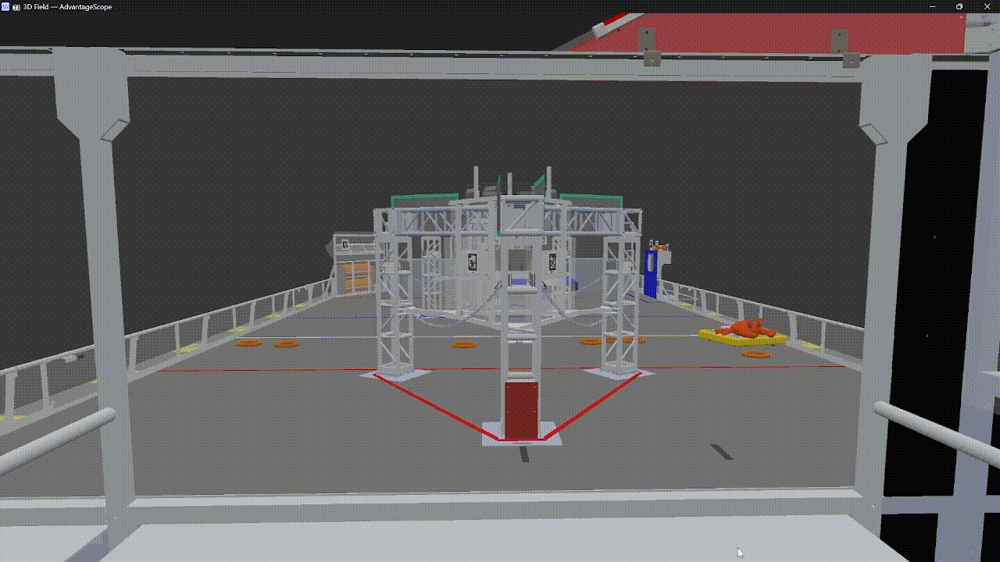
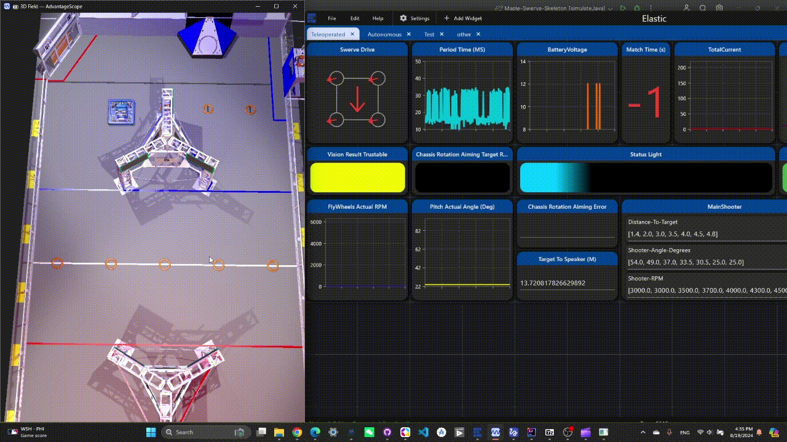
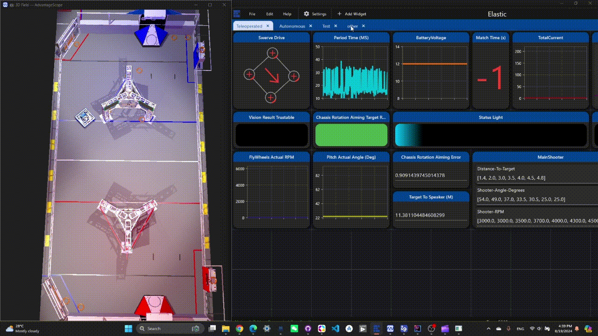
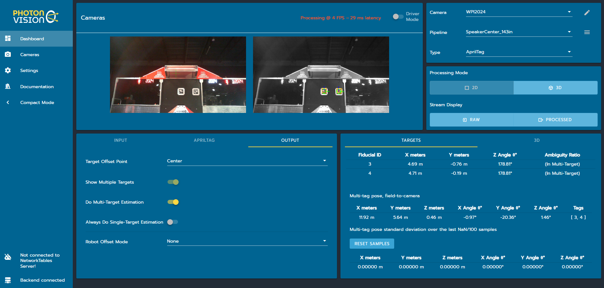
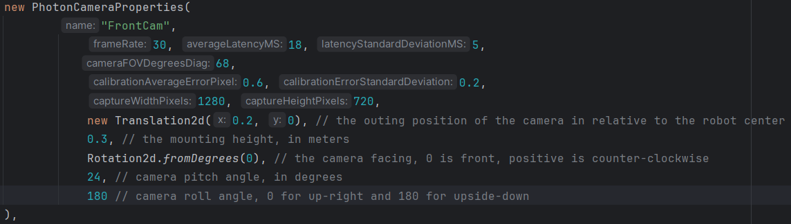
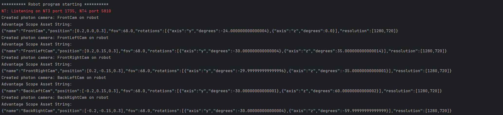

# 🍁 Swerve Skeleton

---

6328 ([TBA](https://www.thebluealliance.com/team/6328/2024) | [Github](https://github.com/mechanical-advantage) | [Website](http://team6328.org/))'s [Advanced Swerve Drive Project](https://www.chiefdelphi.com/t/advantagekit-2024-log-replay-again/442968/54#advanced-swerve-drive-project-2) with More Enhanced Physics Simulation (Collision Detection and More)
> 🙏 We extend our deepest appreciation to [Team 6328](https://www.littletonrobotics.org/) for their [open source project](https://github.com/Mechanical-Advantage), which have made this project possible.
>
> ⚖️ This project is based on an example from [AdvantageKit](https://github.com/Mechanical-Advantage/AdvantageKit/), which is under the [GPLv3](https://www.gnu.org/licenses/gpl-3.0.en.html#license-text) license. All teams are welcome to use it, provided that you adhere to the [Advantage Kit License](./AdvantageKit-License.md).

## Simulation Details

### The Field has Collision Space
The standout feature of this project is the integration of the [dyn4j physics engine](https://github.com/dyn4j/dyn4j), which allows for the creation of a highly realistic and interactive simulation environment.

In our simulator, the robot can collide with field obstacles, interact with opposing robots, and engage with game pieces, providing a dynamic and immersive experience.



### Swerve-Drive Physics Simulation
Previous swerve drive simulations modeled the drivetrain using several [DCMotorSim](https://github.wpilib.org/allwpilib/docs/release/java/edu/wpi/first/wpilibj/simulation/DCMotorSim.html) instances. In contrast, this project's drivetrain simulation calculates the frictional and propelling forces on each swerve module. These forces are then used to model the drivetrain as a rigid body within the physics engine.
[[Source Code](https://github.com/Shenzhen-Robotics-Alliance/Maple-Swerve-Skeleton/blob/main/src/main/java/frc/robot/utils/CompetitionFieldUtils/Simulations/SwerveDriveSimulation.java)]


### Game Pieces and Intake Simulation

In our simulation, game pieces on the field have collision boundaries and can interact with the robot. The simulator also supports a fixed intake module on the robot, enabling it to automatically grab game pieces upon contact.
[[Source Code](https://github.com/Shenzhen-Robotics-Alliance/Maple-Swerve-Skeleton/blob/main/src/main/java/frc/robot/utils/CompetitionFieldUtils/Simulations/IntakeSimulation.java) | [Example Code](https://github.com/Shenzhen-Robotics-Alliance/5516-2024-OffSeason/blob/main/src/main/java/frc/robot/subsystems/intake/IntakeIOSim.java)]


### Opponent Robots Simulation

Simulated opponent robots can be either manually controlled using a gamepad for defensive play or set to follow pre-programmed cycle paths. Like real robots, these opponents have collision boundaries, allowing drivers to practice both defensive and offensive strategies effectively.
[[Source Code](https://github.com/Shenzhen-Robotics-Alliance/Maple-Swerve-Skeleton/blob/main/src/main/java/frc/robot/utils/CompetitionFieldUtils/Simulations/OpponentRobotSimulation.java)]


### Odometry Simulation

By modeling the interaction between the wheels and the floor, our simulation can replicate odometry measurement errors caused by skidding.

Additionally, the IMU simulation incorporates drifting.  Hard impacts on the virtual robot will cause the IMU to drift, just like in real-world.

[[Source Code](https://github.com/Shenzhen-Robotics-Alliance/Maple-Swerve-Skeleton/blob/main/src/main/java/frc/robot/subsystems/drive/IO/ModuleIOSim.java) | [Video](https://youtu.be/ersRWIzC0zc)]


### Vision Simulation
Building on the [PhotonLib Camera Sim](https://docs.photonvision.org/en/latest/docs/simulation/simulation.html), this project features a fully realistic simulation of our custom AprilTag vision odometry.

We've also optimized the vision odometry by incorporating 6328's Log-Replay Technology, which allows for adjustments to our pose estimation strategy during replay, as detailed [in this talk](https://www.youtube.com/watch?v=BrzPw6ngx4o&t=2038s).

We also offer a convenient feature that automatically generates the [Advantage Scope Fix Camera Config](https://github.com/Mechanical-Advantage/AdvantageScope/blob/main/docs/tabs/3D-FIELD.md#fixed-camera), making it easy to set up and view the camera's perspective in Advantage Scope. [Source Code](https://github.com/Shenzhen-Robotics-Alliance/Maple-Swerve-Skeleton/blob/main/src/main/java/frc/robot/utils/CustomConfigs/PhotonCameraProperties.java).


## Setup Guide

- ### CTRE Chassis
  1. Generate [TunerConstants.java](https://github.com/Shenzhen-Robotics-Alliance/Maple-Swerve-Skeleton/blob/main/src/main/java/frc/robot/constants/TunerConstants.java) using [CTRE's Swerve Project Generator](https://v6.docs.ctr-electronics.com/en/latest/docs/tuner/tuner-swerve/index.html) and drop it to `src/main/java/constants/` .
  2. In vscode, use `Control` + `H` to replace all `private` tags in `TunerConstants` with `public`
  3. Delete the last two lines 
    ``` Java
    // TODO: the last two lines MUST be removed
    public static final CommandSwerveDrivetrain DriveTrain = new CommandSwerveDrivetrain(DrivetrainConstants, FrontLeft,
      FrontRight, BackLeft, BackRight);
    ```
  4. Edit a few variables in [DriveTrainConstants.java](https://github.com/Shenzhen-Robotics-Alliance/Maple-Swerve-Skeleton/blob/main/src/main/java/frc/robot/constants/DriveTrainConstants.java)
    ```java
    /**
    * numbers that needs to be changed to fit each robot
    * TODO: change these numbers to match your robot
    * */
    public static final double
      WHEEL_COEFFICIENT_OF_FRICTION = 0.95,
      ROBOT_MASS_KG = 40; // with bumpers
  
    /**
    * TODO: change motor type to match your robot 
    * */
    public static final DCMotor
      DRIVE_MOTOR = DCMotor.getKrakenX60(1),
      STEER_MOTOR = DCMotor.getFalcon500(1);
    ```
    5. Try Driving Your Chassis On Field !!!
- ### Rev Chassis
    > ⚠️ This project **supports** Rev hardware.  However, it has not been tested on a physical Rev Chassis simply because **we don't have one**.  If your team has an Rev Chassis and willing to test and debug our code, you are absolutely welcome and appreciated.
    
    1. in [RobotContainer.java](https://github.com/Shenzhen-Robotics-Alliance/Maple-Swerve-Skeleton/blob/main/src/main/java/frc/robot/RobotContainer.java) line 100, change all `ModuleIOTalon` to `ModuleIOSpark`
       ``` java                 
       /* CTRE Chassis: */
       drive = new SwerveDrive(
         new GyroIOPigeon2(TunerConstants.DrivetrainConstants),
         new ModuleIOTalon(TunerConstants.DrivetrainConstants, TunerConstants.FrontLeft, "FrontLeft"),
         new ModuleIOTalon(TunerConstants.DrivetrainConstants, TunerConstants.FrontRight, "FrontRight"),
         new ModuleIOTalon(TunerConstants.DrivetrainConstants, TunerConstants.BackLeft, "BackLeft"),
         new ModuleIOTalon(TunerConstants.DrivetrainConstants, TunerConstants.BackRight, "BackRight")
       );

       /* REV Chassis */
       drive = new SwerveDrive(
       SwerveDrive.DriveType.CTRE_ON_CANIVORE,
         new GyroIOPigeon2(TunerConstants.DrivetrainConstants),
         new ModuleIOSpark(0),
         new ModuleIOSpark(1),
         new ModuleIOSpark(2),
         new ModuleIOSpark(3)
       );
       ```
    2. in [ModuleIOSpark.java](https://github.com/Shenzhen-Robotics-Alliance/Maple-Swerve-Skeleton/blob/main/src/main/java/frc/robot/subsystems/drive/IO/ModuleIOSpark.java), configure the motor IDs as well as the encoder offsets
    3. In [DriveTrainConstants.java](https://github.com/Shenzhen-Robotics-Alliance/Maple-Swerve-Skeleton/blob/main/src/main/java/frc/robot/constants/DriveTrainConstants.java), replace all references to `TunerConstants` with actual data
## Running Simulation
1. in [Robot.java](https://github.com/Shenzhen-Robotics-Alliance/Maple-Swerve-Skeleton/blob/main/src/main/java/frc/robot/Robot.java) line 19, change `JAVA_SIM_MODE` to `SIM` to run physics simulation or change it to `REPLAY` to perform [6328](https://github.com/Mechanical-Advantage)'s [Log-Replay Technology](https://github.com/Mechanical-Advantage/AdvantageKit/blob/main/docs/WHAT-IS-ADVANTAGEKIT.md).
    ```java
    // Run physics simulation
    private static final Constants.RobotMode JAVA_SIM_MODE = Constants.RobotMode.SIM;
    // Run Log-Replay technology
    private static final Constants.RobotMode JAVA_SIM_MODE = Constants.RobotMode.REPLAY;
    ```
  
    > 💡 There is **no need** to change the mode to `REAL` when deploying to real robot as the program will automatically switch to `REAL` mode if it is detected to be running on a real robot
    ```java
    public static final Constants.RobotMode CURRENT_ROBOT_MODE = isReal() ? Constants.RobotMode.REAL : JAVA_SIM_MODE;
    ```


2. Run the [WPILib Java Simulation](https://docs.wpilib.org/en/stable/docs/software/wpilib-tools/robot-simulation/introduction.html) and connect a gamepad to port 0 
    
3. Open [Advantage Scope](https://github.com/Mechanical-Advantage/AdvantageScope/blob/main/docs/INDEX.md) and [connect to simulator](https://docs.wpilib.org/en/stable/docs/software/wpilib-tools/robot-simulation/introduction.html),
add a new [3D Field Widget](https://github.com/Mechanical-Advantage/AdvantageScope/blob/main/docs/tabs/3D-FIELD.md)

4. Drag `AdvantageKit/RealOutputs/Field/Robot` to `2D Poses`, make it `Robot` (this is where your robot **actually** is in the simulation world)
    
    Drag `AdvantageKit/RealOutputs/Field/Robots` to `2D Poses`, make it `Red Ghost` (these are opponent robots)
    
    Drag `AdvantageKit/RealOutputs/Odometry/Trajectory` to `2D Poses`, make it `Trajectory` (this is the current activate path)
    
    Drag `AdvantageKit/RealOutputs/Odometry/RobotPosition` to `2D Poses`, make it `Blue Ghost` (this is where the odometry think the robot is)

5. Open three [Sendable Choosers](https://docs.wpilib.org/en/stable/docs/software/dashboards/smartdashboard/choosing-an-autonomous-program-from-smartdashboard.html) in `SmartDashboard/FieldSimulation/` called `OpponentRobot1/2/3 Behavior` in the dashboard.  Select `Auto Cycle` to let AI control these robots to do cycles, or select `Joystick Control Left/Right-Handed` to control them manually with another gamepad (port 1/2/3 for opponent robot 1/2/3)

## Setting Up Vision
> 💡 The `subsystems/vision/apriltags` package is our team's implementation of an apriltag vision odometry, which is built on top of [Photon Vision](https://photonvision.org/).
> We've implemented [custom filtering mechanisms]() that enhance accuracy.  We've also provide improved support for [6328's Log-Replay Technique](https://github.com/Mechanical-Advantage/AdvantageKit/blob/main/docs/WHAT-IS-ADVANTAGEKIT.md).
> 
> ⚠️ For teams that already have a reliable vision odometry solution in place, we recommend deleting this package and continuing to use the approach that best suits your needs.
### 1. Configure PhotonVision Coprocessors
On the vision coprocessors, please [enable MultiTag](https://docs.photonvision.org/en/latest/docs/apriltag-pipelines/multitag.html#enabling-multitag) and [update the correct field layout](https://docs.photonvision.org/en/latest/docs/apriltag-pipelines/multitag.html#updating-the-field-layout) according to the [PhotonVision documentation](https://docs.photonvision.org/en/latest/docs/apriltag-pipelines/index.html).



Optionally, if you want to view the individual `camera-to-target` transform calculated by `SolvePNP` for each target during replay, please turn on `Always Do Single-Target Estimation`. *Note that this hurts performance a little.*

### 2. Configuring Camera Constants in The Code
In `constants/VisionConstants.java`, put the infos about your camera here:
```java 
public static final List<PhotonCameraProperties> photonVisionCameras = List.of(
        // declare all the photon cameras here
);
```
Example:


Now the vision system is good to go! Additionally, when a `PhotonCameraProperties` instance is created, it will automatically print a line of `JSON` code containing the position of the [Fixed Camera](https://github.com/Mechanical-Advantage/AdvantageScope/blob/main/docs/tabs/3D-FIELD.md#fixed-camera).
You can use this output to easily [configure a custom robot asset for Advantage Scope](https://github.com/Mechanical-Advantage/AdvantageScope/blob/main/docs/CUSTOM-ASSETS.md).


### 3. Debugging the Vision During Replay
The vision odometry uses a technique called [selective logging](https://youtu.be/BrzPw6ngx4o?si=SRhAgu99mGOL1mYB&t=1594) developed by [Team 6328](https://github.com/Mechanical-Advantage/).

It only logs the raw inputs from the cameras and the final pose estimation result. If there's an issue with the result and you need to debug it, you must [replay the code](https://github.com/Mechanical-Advantage/AdvantageKit/blob/main/docs/WHAT-IS-ADVANTAGEKIT.md) to observe the detailed filtering process and pinpoint the problem.

Open the log file using [AdvantageScope](https://github.com/Mechanical-Advantage/AdvantageScope). And change java sim mode to `Replay` in `Robot.java`.  Run **Simulate Java**.
```java
// Run Replay
private static final Constants.RobotMode JAVA_SIM_MODE = Constants.RobotMode.REPLAY;
```

Now Open the Replayed Log in AdvantageScope.  The replayed log is named `ORIGINAL-LOG-FILE-NAME_replayed.wpilog`

Drag Field `AdvantageKit/RealOutputs/AprilTags/Filtering/VisibleFieldTargets` to `3D Poses`, make it `Vision Target` (these are the AprilTags on the field that are seen by one or more cameras).

Drag Field `AdvantageKit/RealOutputs/AprilTags/Filtering/AprilTagsObservedPositions` to `3D Poses`, make it `AprilTag 36h11` (this represents the observed positions of the tags on the field, assuming the current odometry pose is correct)

Drag Field `AdvantageKit/RealOutputs/AprilTags/Filtering/ValidPoseEstimations` to `3D Poses`, make it `Green Ghost` (these are the pose estimation results that the filtering mechanism has deemed **valid**)

Drag Field `AdvantageKit/RealOutputs/AprilTags/Filtering/InvalidPoseEstimations` to `3D Poses`, make it `Red Ghost` (these are the pose estimation results that the filtering mechanism has marked as **invalid** or **noisy**)

This is how it should look: (log file during [WRC Beijing Off-season Event](https://www.thebluealliance.com/event/2024xxcha), Elimination 4)


You can see a lot of red results in the output, indicating that something is wrong.

Many AprilTags observed on the right-hand side of the robot appear to be floating in midair, likely due to an issue with the front-right camera.

To troubleshoot, we removed the `FrontRightCam` from the  [camera configuration](https://github.com/Shenzhen-Robotics-Alliance/Maple-Swerve-Skeleton/?tab=readme-ov-file#2-configuring-camera-constants-in-the-code),
effectively disabling the camera for the replay.

Upon running the replay again, the red "ghost" errors disappeared.

> It turns out the camera stand was bent.

This is a great example of how log-replay can quickly help you identify and resolve issues.

### 4. Enhanced Log-Replay Techniques
Since the vision odometry logs all the raw camera inputs, you will be able to change your pose estimation code and filtering mechanism during replay.

> TODO: write the documents on how to fine tune the filtering mechanism using replay