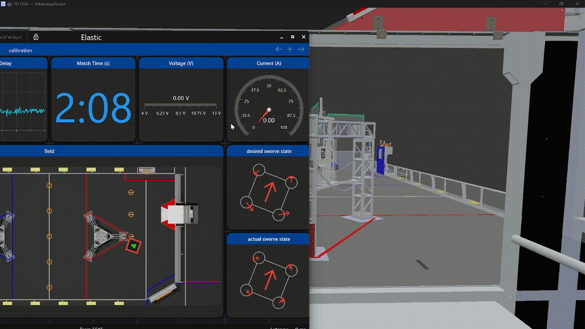
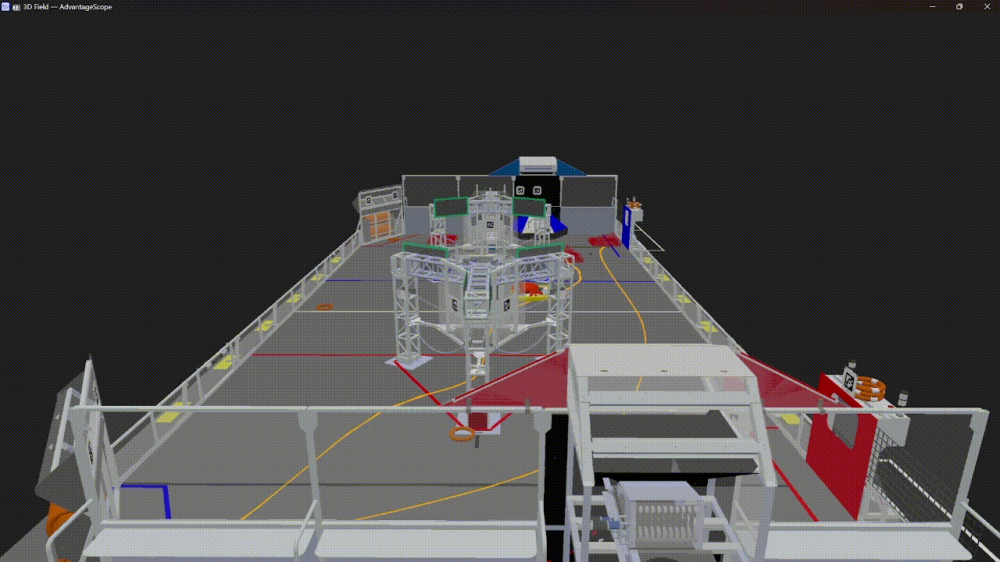
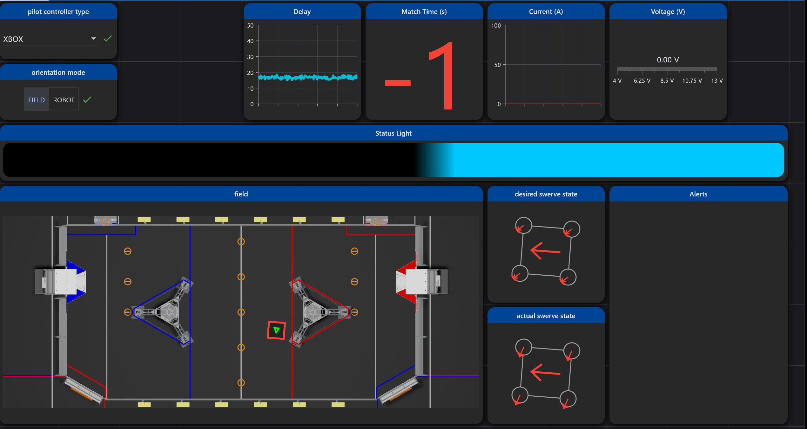

# The 🍁 Swerve Skeleton

---

[Iron Maple](https://www.thebluealliance.com/team/5516/2024)’s Swerve Drive Skeleton Project

Completely Simulated Swerve-Bot, with [250HZ Odometry](https://pro.docs.ctr-electronics.com/en/stable/docs/application-notes/update-frequency-impact.html), [6328's Log-Replay Technology](https://www.youtube.com/watch?v=BrzPw6ngx4o&t=1517s) and Vision

> 🙏 We extend our deepest appreciation to [Littleton Robotics](https://www.littletonrobotics.org/) for their [open source projects](https://github.com/Mechanical-Advantage), which have made this project possible.
>
> ⚖️ This project is based on the [Advanced Swerve Drive Example](https://github.com/Mechanical-Advantage/AdvantageKit/tree/main/example_projects/advanced_swerve_drive/src/main) from [AdvantageKit](https://github.com/Mechanical-Advantage/AdvantageKit/), which is under the [GPLv3](https://www.gnu.org/licenses/gpl-3.0.en.html#license-text) license. All teams are welcome to use this project, provided that you adhere to the [Advantage Kit License](./AdvantageKit-License.md).

## 👭Digital-Twin

A complete-real simulation, with physics engine, score-count, human-players and opponent robots.

- **Uses Actual Robot Code** in the simulator. This means that you can tune Auto-Stages, PIDs, Auto-Scoring functions and more.  The simulator display robots through https://github.com/Mechanical-Advantage/AdvantageScope.
- **Swerve-Drive Physics Simulation**, fine-tuned with experimental data measured in our training field, as well as real-life data gathered from real competitions this year.

  

- **2D Rigid-Body Collision Simulation** for game-pieces and robots on field.  Using open source 2d physics engine https://github.com/dyn4j/dyn4j.

  

- **Opponent Robots Simulation** that can either be controlled by a gamepad to play defense or follow pre-stored cycle paths.

  
- **Odometry Simulation**, which behaves like a real odometry: when you hit the wall, it skids and the IMU drifts.  [Video](https://youtu.be/ersRWIzC0zc) 
- 
- **Vision Simulation** with [PhotonLib](https://docs.photonvision.org/en/latest/docs/simulation/simulation.html), [code](https://github.com/Shenzhen-Robotics-Alliance/Maple-Swerve-Skeleton/blob/dev/src/main/java/frc/robot/subsystems/vision/VisionIOSim.java).

## 🕹️Driving

- **250HZ Odometer**, Custom [Odometry Thread](https://github.com/Shenzhen-Robotics-Alliance/Maple-Swerve-Skeleton/blob/main/src/main/java/frc/robot/subsystems/drive/OdometryThreadReal.java)
- **A Star Auto-Alignment** [Code](https://github.com/Shenzhen-Robotics-Alliance/Maple-Swerve-Skeleton/blob/main/src/main/java/frc/robot/commands/drive/AutoAlignment.java), [Video](https://www.youtube.com/watch?v=HjQfurIPfgw)
- **Skid Detection** inspired by [1690 online software session](https://youtu.be/N6ogT5DjGOk?feature=shared&t=1674)
- **Acceleration Constraining** during TeleOp, [code](https://github.com/Shenzhen-Robotics-Alliance/Maple-Swerve-Skeleton/blob/main/src/main/java/frc/robot/commands/drive/JoystickDrive.java).
- **Robot Configuration Storage** in JSON files, [code](https://github.com/Shenzhen-Robotics-Alliance/Maple-Swerve-Skeleton/blob/main/src/main/java/frc/robot/utils/Config/MapleConfigFile.java), [example configs](https://github.com/Shenzhen-Robotics-Alliance/Maple-Swerve-Skeleton/tree/main/src/main/deploy/configs/ChassisWheelsCalibration).
- **Robot Status Visualization** through [Elastic Dashboard](https://github.com/Gold872/elastic-dashboard), [AdvantageScope](https://github.com/Mechanical-Advantage/AdvantageScope), LED and [Network Alerts](https://github.com/Mechanical-Advantage/NetworkAlerts)

## 🖥️ Dashboard

## 🤖Auto

- **Decisive Autonomous Framework** 
- **Path-Planning**, [PathPlanner](https://github.com/mjansen4857/pathplanner) and [Choreo](https://github.com/SleipnirGroup/Choreo) both supported. With Custom Follow-Path-Command.

## 📝Logging

Built Upon [AdvantageKit](https://github.com/Mechanical-Advantage/AdvantageKit), all sensor inputs are logged and recorded for after-match analysis.

## 👁️Vision

- **April-tag Robot Localization** With [Photon Vision](https://photonvision.org/), Also works in [Simulation](https://github.com/Shenzhen-Robotics-Alliance/Maple-Swerve-Skeleton/blob/dev/src/main/java/frc/robot/subsystems/vision/VisionIOSim.java)
- **360° Game-Piece Detection** running on Jetson-Orin-Nano coprocessor. [GitHub - FRC-Phantom-Vision: machine-learning-based object-detection tool for FRC](https://github.com/Shenzhen-Robotics-Alliance/FRC-Phantom-Vision)
